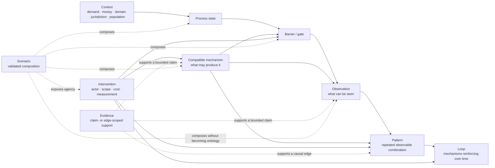

# Content and Coverage Audit — 2026-09-05

## Verdict

The registry is structurally coherent and internally linked, but it must not claim universal coverage. The explicit coverage boundary contains 92 materially distinct situation slots: 50 covered, 19 partial, and 23 absent, for a weighted score of **64.7%**. That score is a reviewable inventory of the current model, not a claim that 64.7% of all possible hiring situations can be enumerated.

This audit read the full English and Ukrainian corpus, all scenario compositions, all presentation archetypes, and all evidence records. It then checked the wording against the graph relations and performed a risk-based source review of high-consequence legal claims.

The executable source for the boundary is [`data/coverage/model.json`](../../data/coverage/model.json). Run `pnpm audit:coverage` to reproduce the counts and list every partial or absent slot.

## Logical model

The completeness question is therefore not “does every observation have one cause?” A complete case needs:

1. a context in which it can occur;
2. an observable trace;
3. multiple compatible mechanisms where the trace is ambiguous;
4. explicit non-inferences;
5. a probe that either rules out a mechanism logically or merely weighs against it;
6. evidence scoped to the claim or causal edge it supports;
7. an action owned by a named actor, with cost and measurement;
8. a scenario showing how the pieces compose.

## Coverage boundary

| Dimension | Score | Covered / partial / absent | Direction of skew |
| --- | ---: | ---: | --- |
| Affected population | 27.8% | 2 / 1 / 6 | Strongly under-modelled |
| Cohort and plurality | 37.5% | 1 / 1 / 2 | Single-process viewpoint dominates |
| Memory across processes | 37.5% | 1 / 1 / 2 | Weak longitudinal coverage |
| Domain and arrangement | 50.0% | 2 / 2 / 2 | Software and client-vendor staffing dominate |
| Entry path | 50.0% | 3 / 2 / 3 | Inbound/outbound dominate; referral and rehire absent |
| After acceptance and start | 60.0% | 2 / 2 / 1 | Pre-hire funnel is deeper than post-start outcomes |
| Financial chain | 66.7% | 4 / 0 / 2 | Salary/runway strong; benefits and relocation absent |
| Evidence role | 66.7% | 3 / 2 / 1 | Source presence stronger than claim-level support |
| Jurisdiction | 70.0% | 3 / 1 / 1 | US/EU/UK/Ukraine only |
| Dialogue and interaction | 72.2% | 6 / 1 / 2 | Employer-led interaction dominates |
| Demand and funding | 80.0% | 3 / 2 / 0 | Strongest contextual axis |
| Observable outcome | 83.3% | 7 / 1 / 1 | Negative outcomes dominate; candidate decline absent |
| Side and agency | 87.5% | 3 / 1 / 0 | Candidate evaluation of employer remains partial |
| Internal decision process | 91.7% | 5 / 1 / 0 | Deep employer-internal modelling |
| Statements and fidelity | 91.7% | 5 / 1 / 0 | Strong signal/inference separation |

### Directional skews

- **Employer-side over candidate-side:** 22 of 24 interventions are controlled by an employer, recruiter, manager, or ATS vendor; only 2 are candidate actions.
- **Organizational over individual:** intervention scope is 14 organizational, 5 team, 2 individual, 2 ecosystem, and 1 industry.
- **Low-cost over structural change:** 15 interventions are low-cost and 9 medium-cost; none are classified high-cost.
- **Technical over general labour markets:** software and client-vendor staffing are covered; nontechnical and temporary/seasonal work are absent.
- **Negative outcome over successful resolution:** silence, rejection, reposting, compensation change, and offer withdrawal are covered; successful hire is partial and candidate decline absent.
- **Single application over portfolio behaviour:** parallel applications, competing offers, rehire, and persistent do-not-rehire/history effects are absent.
- **General process over affected populations:** disability/accommodation, race/ethnicity, gender/pregnancy, religion, sexual orientation/gender identity, and caregiving constraints are all explicitly absent.
- **Employer-policy intervention over candidate agency:** employer-policy owns 10 interventions, hiring managers 6, recruiters 4, ATS vendors 2, and candidates 2.

## Composition depth

The ontology has no broken references or isolated findings, but higher-order composition is sparse:

- scenarios use 13/21 observations (61.9%), 8/28 mechanisms (28.6%), 5/16 barriers (31.3%), 2/4 processes (50%), 0/52 evidence records, and 8/24 interventions (33.3%);
- four of six scenarios currently contain observations only; `application_silence` and `closed_then_reposted` are the two fully composed examples;
- only 9/28 mechanisms appear in a pattern;
- only 6/28 mechanisms appear in a loop;
- `bar.client_profile_approval_and_client_interview` has no mechanism operating at it.

The next depth release should complete the existing six scenarios before adding many new ontology entries. Each completed scenario should name observations, compatible mechanisms, barriers, process state, evidence, excluded claims, and actor-owned actions.

## Editorial and inference findings

### Probe semantics

All 29 mirrored directional probe outcomes were heuristic signals rather than logical incompatibilities. They were moved from `excludes` to `weighs_against`, and their English/Ukrainian explanations were rewritten from “proves/rules out” language to calibrated “makes more or less plausible” language.

`excludes` remains in the schema for a future outcome that is definitionally incompatible with a mechanism. Graph narrowing removes only `excludes`; `weighs_against` is reported but never eliminates a candidate mechanism.

### Pattern claims

All four pattern `establishes` fields overreached beyond their triggers. They now establish only observable sequences:

- a closed process followed by a materially similar listing does not establish why the search restarted;
- asking for candidate compensation before disclosing the band establishes an information asymmetry, not its eventual causal effect;
- an impossible experience threshold does not establish who copied it or whether it caused rejection unless an operational record connects the steps;
- adjacent-level rejection messages establish the two stated outcomes, not a universal market-wide level gap.

### Presentation language

Unsupported superlatives such as “the most common,” “the only gate,” and “the one financial fact” were removed. Ukrainian mistranslations and untranslated speaker labels were corrected. The legacy archetype key `lawful` is now displayed as **Systematic / Системне**; it describes repeatability, never legality.

### Evidence labels

Three authored workflow models were labelled `strongly_supported` without evidence, and all 13 conceptual financial records were labelled `supported` without evidence. They are now `unknown`: descriptive constructs until evidence is attached. Validation now rejects `supported`, `strongly_supported`, `contradicted`, or `proven` when no source is linked; `proven` still requires primary or research evidence.

## Evidence quality

All 52 evidence URLs are represented and all evidence records are used. Link health was strong in the audit: 48 sources resolved successfully and four publisher sites returned access-control responses rather than missing pages; no 404/410 source was found.

Support is nevertheless concentrated. Across 155 unique entity-to-source relationships, the top three sources carry 68 links (**43.9%**):

1. HBS/Accenture Hidden Workers — 32 entities;
2. interview-reliability meta-analysis — 20;
3. Clarify Capital ghost-jobs survey — 16.

This is a breadth risk: a source can be relevant to many entries without directly proving every attached sentence.

### High-consequence source corrections

- [Employment Rights Act 1996 §86](https://www.legislation.gov.uk/ukpga/1996/18/pdfs/ukpga_19960018_en.pdf) establishes statutory minimum notice after one month of continuous employment. It does not define probation or pre-start withdrawal.
- [GOV.UK job-offer guidance](https://www.gov.uk/job-offers-your-rights) states that an accepted unconditional offer is binding and describes potential breach-of-contract consequences. It does not establish employer motive or frequency.
- [Ukraine Labour Code arts. 26–28](https://zakon.rada.gov.ua/laws/show/322-08) defines probation limits, continuation after expiry, written three-day notice for a probation-based dismissal, and the right to challenge it. It does not prove that employers lower interview thresholds.
- [29 C.F.R. Part 1607](https://www.govinfo.gov/content/pkg/CFR-2022-title29-vol4/pdf/CFR-2022-title29-vol4-part1607.pdf) concerns selection-procedure impact and validity; [EU AI Act Article 14](https://eur-lex.europa.eu/eli/reg/2024/1689/oj/eng) concerns oversight of high-risk AI. Neither mandates preparation time or tie-breaking rules for ordinary human interview panels.
- The FCRA alternative notice route is restricted to specified transportation employment; it is not a general remote-application exception.
- US and UK fair/open-competition rules cited in the registry are public-service rules, not a universal private-sector disclosure duty.

This document is a data-quality review, not legal advice.

## Priority enrichment backlog

### P0 — credibility

1. Review every remaining `proven` entity at claim level, recording direct/indirect/context support and jurisdiction.
2. Attach evidence to each causal emission edge or explicitly mark it as unverified.
3. Separate evidence for a problem's existence from evidence that an intervention is effective.
4. Add evidence scope, jurisdiction, period, and limitations as structured fields rather than prose conventions.

### P1 — depth

1. Complete all six current scenarios and localize every scenario sentence.
2. Add patterns for the 19 mechanisms not represented in any pattern where recurrence is genuinely observed.
3. Add loops only where a feedback path and temporal recurrence are evidenced; 22 mechanisms currently sit outside loops, which is not automatically a defect.
4. Expand each financial record with units, currency/time basis, flow role, conservation assumptions, and an example transaction.
5. Add an observable failed-probation outcome instead of representing probation only as a barrier and hypothesized mechanism.

### P2 — breadth

1. Add candidate withdrawal/decline, accommodation requests, referral, rehire, contract-to-hire, parallel applications, and competing offers.
2. Add nontechnical and temporary/seasonal examples before generalizing technical-hiring conclusions.
3. Add carefully scoped coverage for disability, race/ethnicity, gender/pregnancy, religion, sexual orientation/gender identity, and caregiving constraints.
4. Expand beyond US/EU/UK/Ukraine only through jurisdiction-specific primary sources.

## Release acceptance targets

| Target | Required result |
| --- | ---: |
| `proven` claims with direct claim-scoped support | 100% |
| Evidence-bearing epistemic labels without a source | 0 |
| Probe language claiming certainty for `weighs_against` | 0 |
| Completed current scenarios | 6/6 |
| Scenario localization | 100% |
| Machine surfaces declaring locale support | 100% |
| Top-three evidence concentration | below 30% where new sources genuinely diversify support |
| Coverage claims | generated from the executable coverage model |

## Method and limitations

The audit reviewed exact authored text and checked structural facts with the registry loaders and graph. Coverage slots are deliberately not a Cartesian product: multiplying 15 axes would produce many meaningless combinations and a false denominator. A slot is included only when it represents a materially distinct situation the atlas claims it should express.

The coverage model measures representation, not prevalence or social importance. `covered` means a direct structured representation and a usable path exist; it does not mean the entry is perfectly evidenced, equally deep, or globally applicable.
